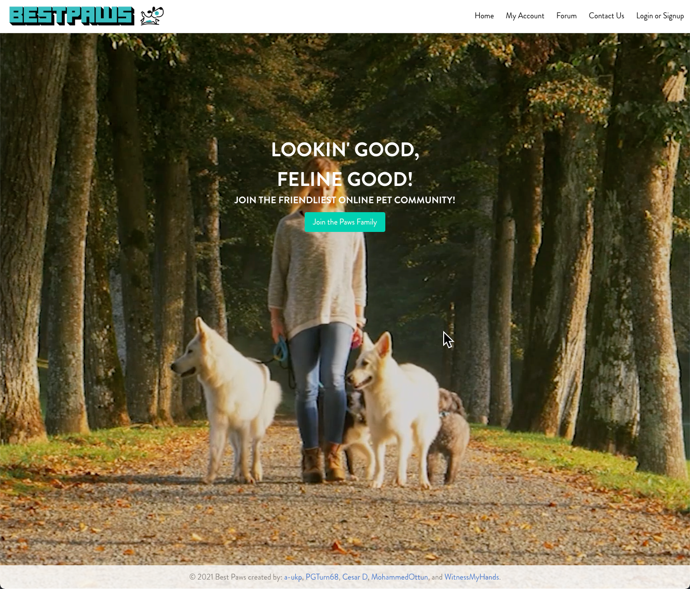

# Best Paws 🐾

## Table of Contents
- [Best Paws 🐾](#best-paws-)
  - [Table of Contents](#table-of-contents)
  - [Description 🖥️](#description-️)
    - [User Story](#user-story)
    - [Acceptance Criteria](#acceptance-criteria)
  - [Usage](#usage)
    - [Link](#link)
      - [Preview](#preview)
  - [!Site Preview](#)
  - [Future Ideas](#future-ideas)
  - [Contributors 🐶🐱🐰](#contributors-)
    - [Back-end](#back-end)
    - [Front-end](#front-end)
  - [Credits](#credits)
  - [Issues](#issues)

---

## Description 🖥️
Discover breeds of dogs and cats, join our community forums, share stories of your best-paw-friends!

### User Story
```
As a pet owner,
I want an online community 
so that I can engage with other pet owners.
```

### Acceptance Criteria
```
GIVEN a user visits the site
WHEN the page loads
THEN they are presented options to log in or create an account.

GIVEN a user clicks to create an account
THEN they are asked to enter full name, email, password, pet type, name, and breed.

GIVEN a user logs in
THEN they are presented a navigation bar with "Forum", "Dogs", "Cats", and "My Account" tabs.

GIVEN a user clicks the "Forum" tab
THEN they are presented with a list of topics.

GIVEN a user clicks on a topic
THEN they are taken to a page where they can view and create posts.

GIVEN a user clicks on the post
THEN they are taken to a page where they can view and create comments.

GIVEN a user clicks on "Dogs & Cats" tab
***THEN they are able to locate a dog park***
AND search up different breeds of dogs and cats.

GIVEN a user clicks on "My Account" tab
THEN they are presented with their personal information
AND view and delete posts and comments they have created
AND view, update, and delete their pet information.

GIVEN a user clicks on another user
THEN they can view others' name and pet information.
```
---

## Usage
* To view and post to our community forums, create a free account!

### Link
https://bestpaws.herokuapp.com/

#### Preview

---

## Future Ideas
* Park locator - Match pet owner based on their geograhical location 
* Breed match - Match like-minded pet owners that have pet breeds in common
* Loadbalancing site traffic


---

## Contributors 🐶🐱🐰
### Back-end
* [Anna Phung](https://github.com/a-ukp)
* [Mohammed Ottun](https://github.com/MohammedOttun)
* [Cesar De La Portilla](https://github.com/DLP713)

### Front-end
* [Carlos Barrientos](https://github.com/WitnessMyHands)
* [Paul Turner](https://github.com/Pgturn68)

### Team Table
| Letter      | Team Member |
| ----------- | ----------- |
| A           | Anna      |
| B   | Mohammed        |
| C           | Cesar      |
| D   | Carlos        |
| E           | Paul      |
---

## Credits
* [Express](https://www.npmjs.com/package/express)
* [Sequelize](https://www.npmjs.com/package/sequelize)
* [Connect Session Sequelize](https://www.npmjs.com/package/connect-session-sequelize)

---

## Issues
* Login - Users are unable to login successfully
* Route guards for logged in users
* Dynamically linking post to comments
* Dynamically linking posts to topics in the forum
  