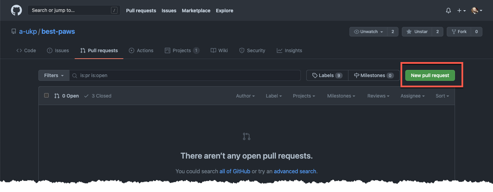
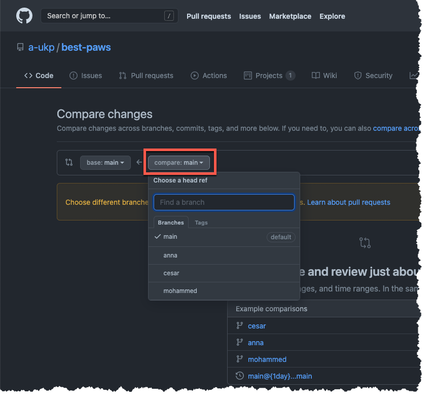
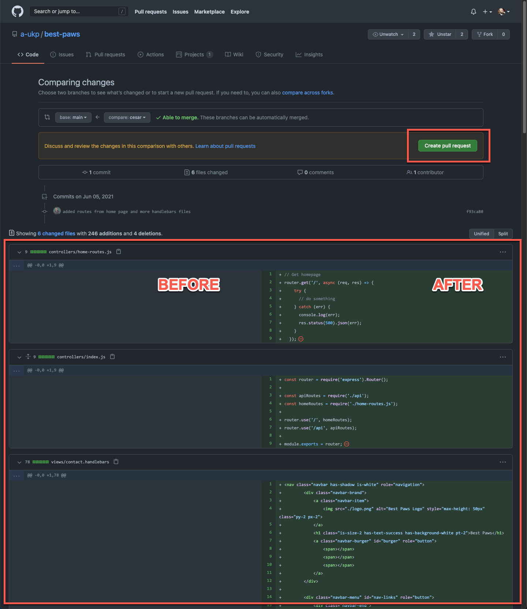
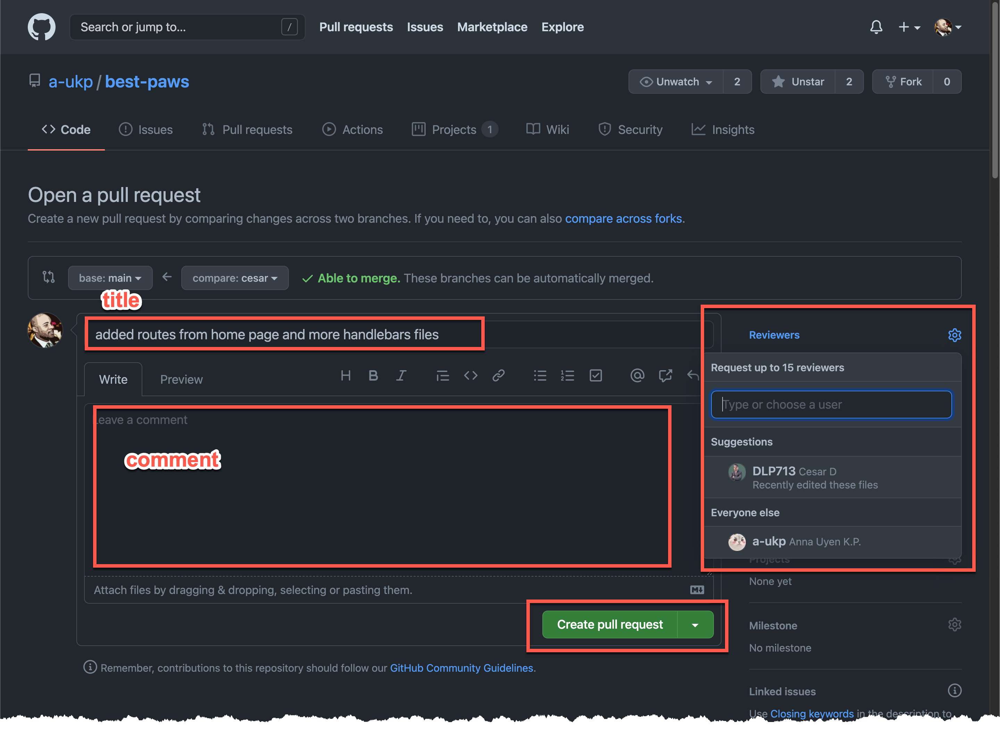
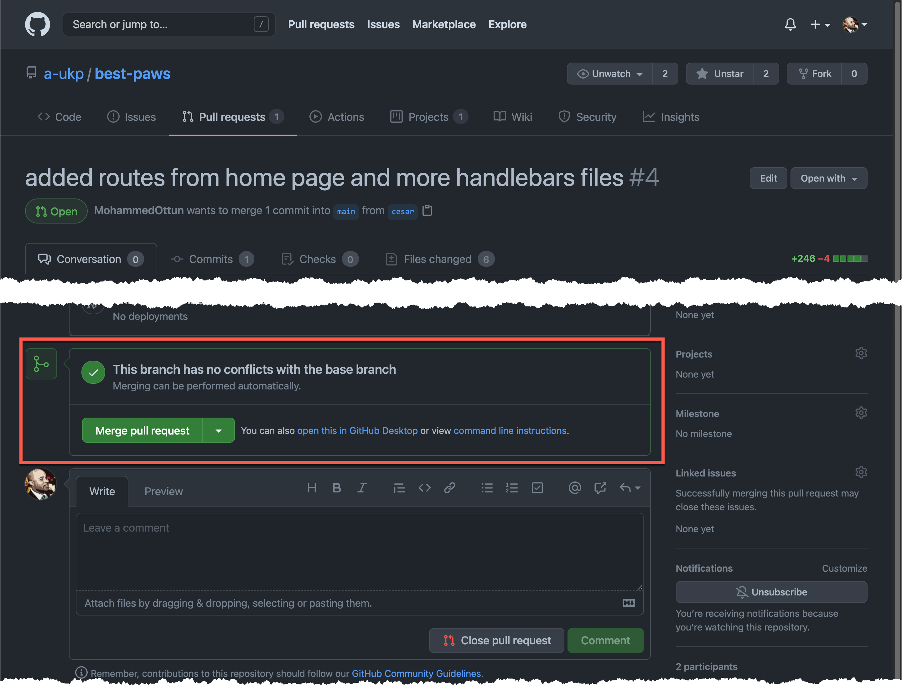

# Best Paws 🐾 - Developer Guide

## How do I start?
1. From a terminal, navigate to the directory on your computer where you'd like to store all things related to this project. 
1. Clone the project locally.
  
        git clone git@github.com:a-ukp/best-paws.git

1. Create a branch locally, this will be your working branch, i.e you will work within this branch. Let's call it `myBranch`

        git checkout -b mybranch main

1. Now, you have:
     - created a branch called `myBranch`
     - you have checked out `myBranch`

1. You can always confrm by using your current branch: `git branch`
1. You are now ready to collaborate.

## Before you push!
1. Get the latest code from `main` branch

        git fetch --all

1. Merge the changes into your branch (`myBranch`). This means that you are getting the latest before you push your changes.
1. It will give you an opportunity to **resolve merge conflicts**.

        git merge origin/main

1. If there are any conflicts, you'll get warning messages in the command line.
1. Simply make the necessary **corrections** in your code edit (**VS Code**).

## How push my code?
1. After you have made changes, add **all** or **some** of your changes:

        git add .
        git add /path/to/folder/orFile.js

1. Commit your stages changes with a message:

        git commit -m "Some changes I have made."

1. Push your changes:

        git push origin myBranch

  **Note:** This command, if ran for the first time will create a remote verison of your branch: `origin/myBranch`

## How does my code make it to the main branch?
After you have pushed your code. Now it's time to get your code **merged** into the `main` branch. To do this, you'll need a **pull request**.

1. Go to the pull request page of the repository: [Best-Paws pull requests](https://github.com/a-ukp/best-paws/pulls)
1. Click on the **New Pull Request** button.
  
    

1. Click on the **compare** drop-dowm menu and select your branch name, i.e `myBranch`.

    

1. A page should display `diff`s: differences between the `main` branch (on the left) and `myBranch` (on the right)

    

1. Click on the **Create pull request button**.

    

1. Enter a descriptive title in the title field.
1. Enter some comment in the comment textarea *(Optional)*.
1. Add a reviwer *(member of the team you'd like a code review from)*.
1. Click on the **Create pull request** button.

    

1. When the code reviewer clicks on the **Merge pull request** button, your code will be successfully merge with the `main` branch.
1. **Congratulations!** You have now contributed to the project.

## Conflicts happen - that's not a bad thing!
Here's how to resolve conflicts:

1. 